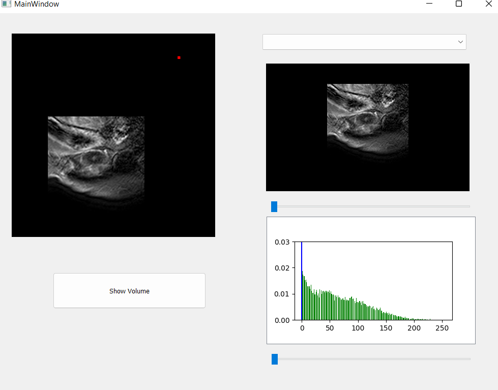
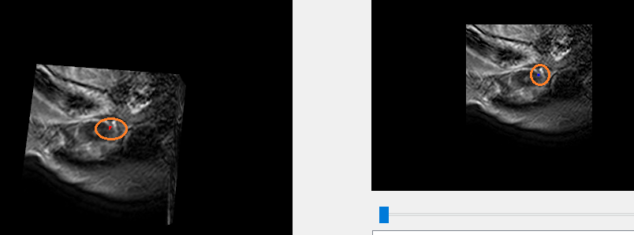
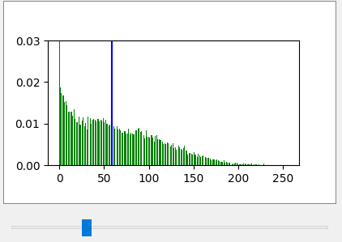
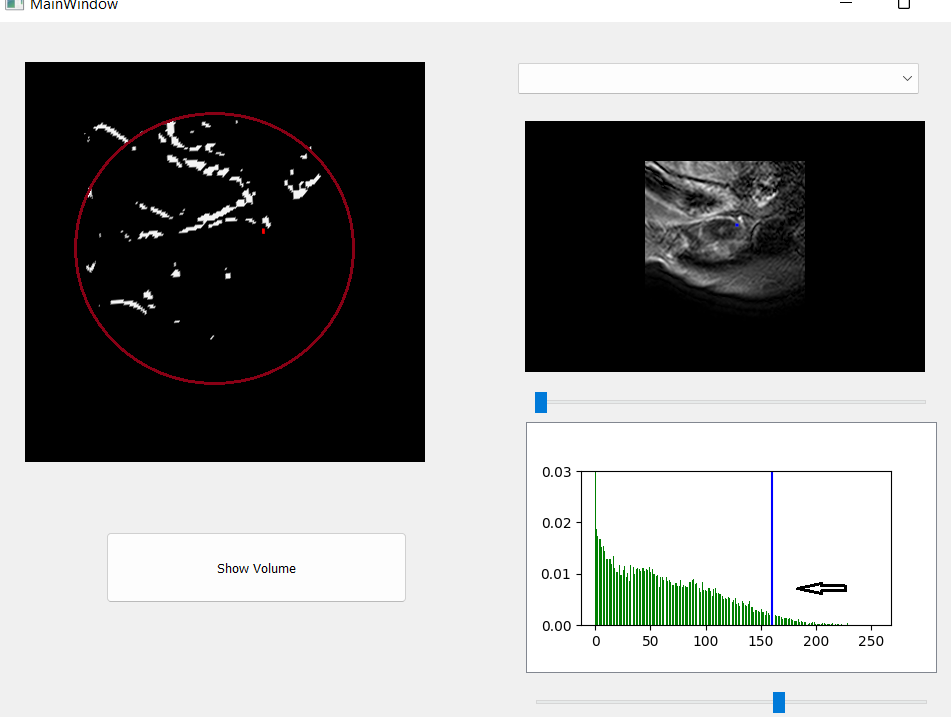

# 3D_surface_viewer
A platform that:
- Read .mat images
- Use VTK to show 3D surface and 2D slice of the surface

- Map between the slice and the volume which have different resolutions, by clicking on the slice it draws a point on the volume that is corresponding to that point

- Display Histogram of the images  

- Apply threshould selected from the histogram to the surface to show the diffused scars from LGE images

